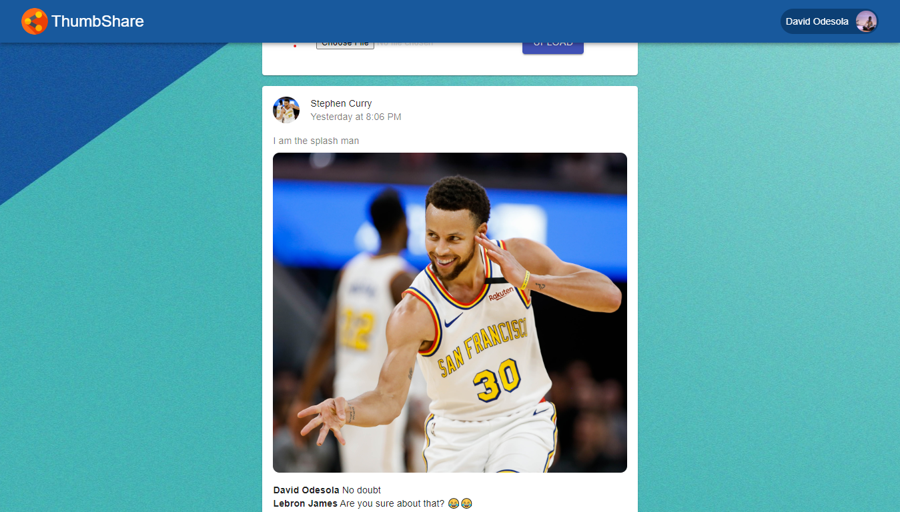

## ThumbShare

ThumbShare is an app that lets its users share various photos with family and friends online.

#### Functionalities...
- User Authentication
- Profile Editing
- Image Sharing
- Realtime comments

You can check it out right here [ThumbShare](https://thumbshare-2020.web.app).

### Powered by
 
    
 

######Note: This app is currently in development stages. More cool features would be integrated in the foreseeable future. 😎😎
